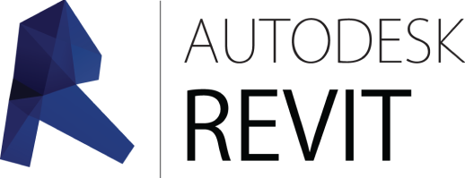

  

# Автоматический установщик всех необходимых программ для учебы в ВГТУ на специальности:
- 07.03.01 - Архитектура Очная;
- 07.03.02 - Реконструкция и реставрация архитектурного наследия Очная;
- 07.03.03 - Дизайн архитектурной среды Очная;
- 07.03.04 - Градостроительство;

# Программы и инсталяторы

-  AutoCAD
-  ArchiCAD
-  Corona
-  Lumion
-  Photoshop
-  Revit
-  SketchUp
-  3ds Max 
